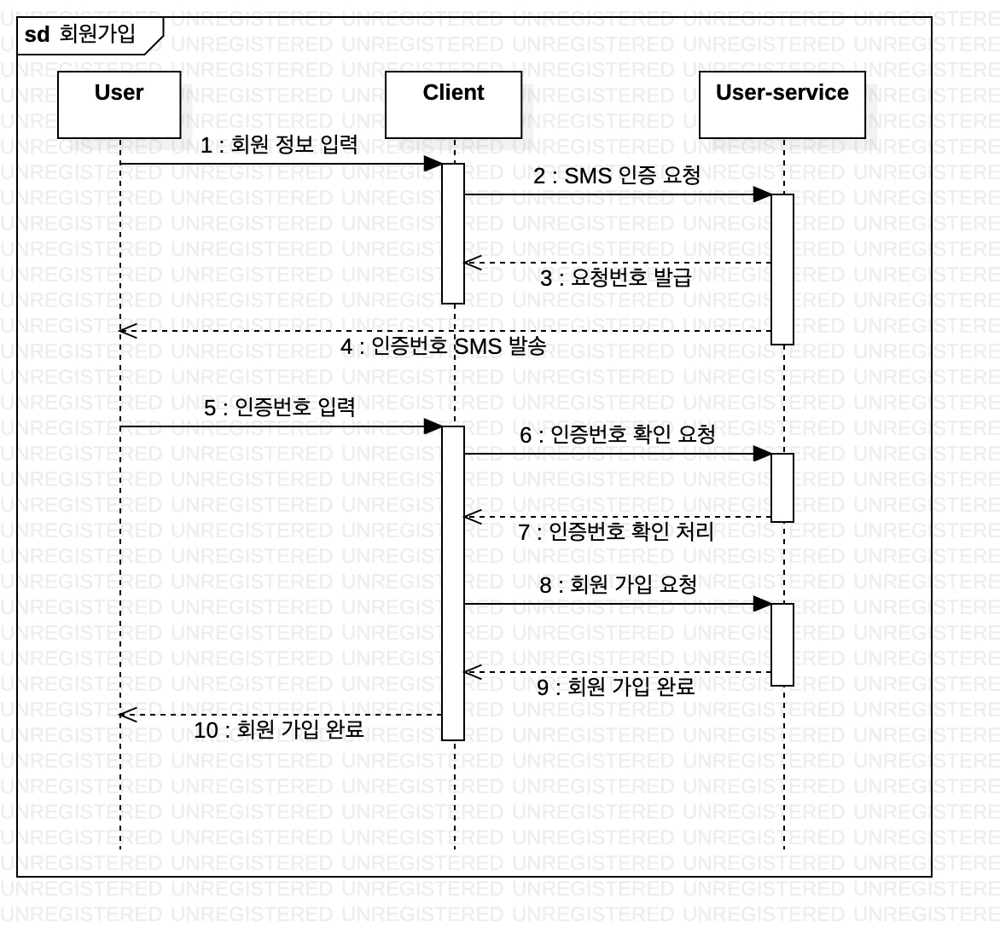
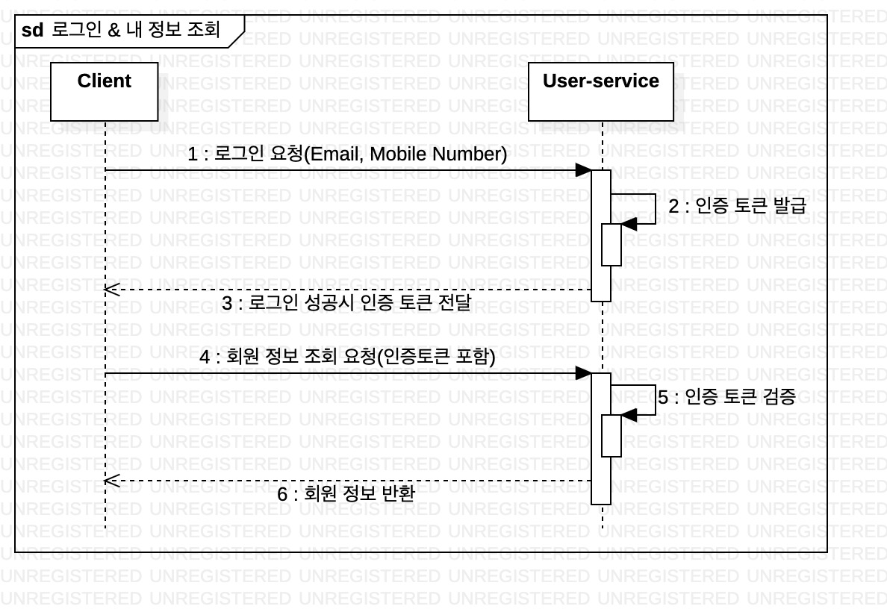
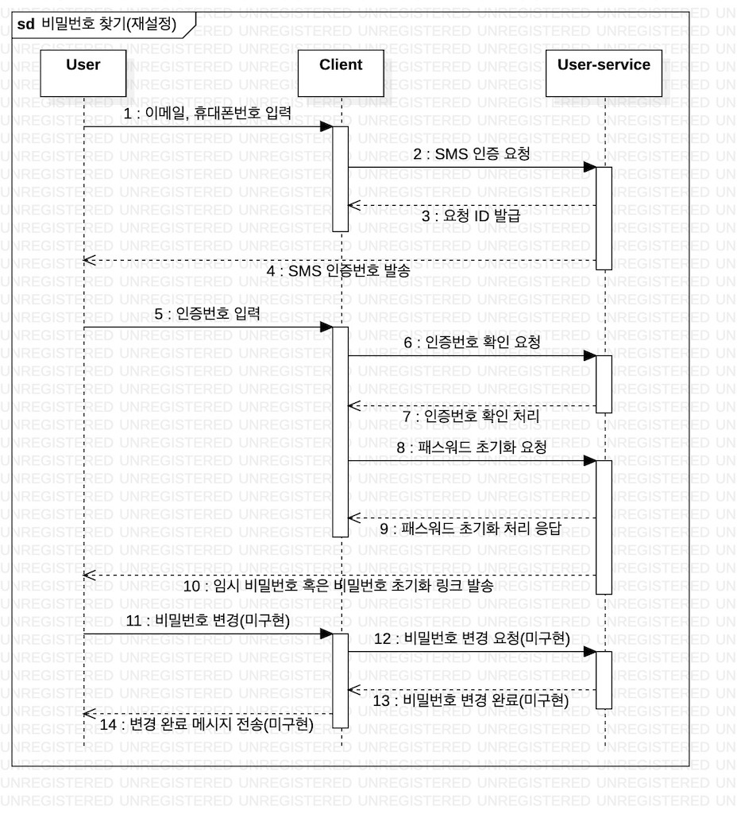

## 회원 가입 API 예제

---
```
간단한 회원 가입 및 조회 기능을 구현합니다.
SMS 인증도 포함하여 구현하였습니다.

* 실제 SMS 및 email은 미전송
```

---

## 주요 기술 스택

---
- Python 3.7 (https://www.python.org/downloads/release/python-3712)
- Flask (https://flask.palletsprojects.com/en/1.1.x)
- Flask Rest X (https://flask-restx.readthedocs.io/en/latest)
- SQLAlchemy (https://www.sqlalchemy.org)
- Marshmallow (https://marshmallow.readthedocs.io/en/stable/index.html)
- pytest (https://docs.pytest.org/en/6.2.x)
- Postgre DB 13 (https://www.postgresql.org)
- Docker (https://www.docker.com)
---

## User-service environments

---
```
FLASK_ENV: 플라스크 환경 변수 (development, production)
DB_TYPE: DB 타입
DB_USER: DB 계정
DB_PASSWORD: 패스워드
DB_HOSTNAME: 호스트
DB_PORT: 포트
DB_NAME: 이름
```
---

## 빌드 및 실행 방법
```
# 유저 서비스 이미지 빌드
make user-service-dev

# 실행
make docker-run

# 종료
make docker-stop
```

## API document

- 앱 실행 후 Swagger document 생성
- http://localhost:5000
- Production 서버의 경우 API 문서 미생성


## Test

```
make pytest
or
./script/pytest.sh
```


## Sequential Diagram






